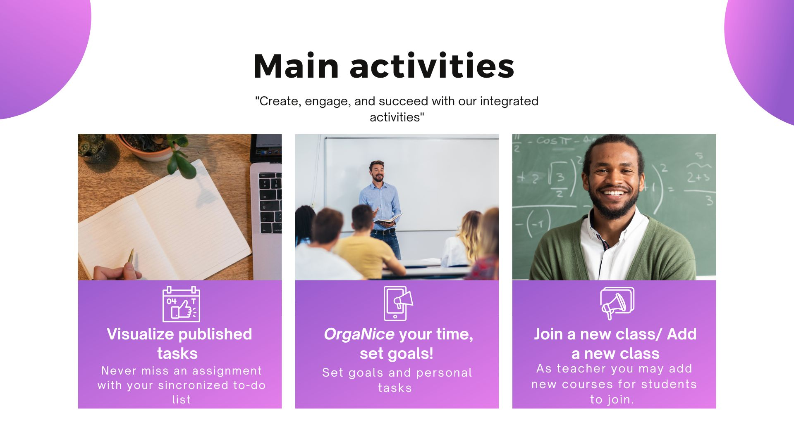
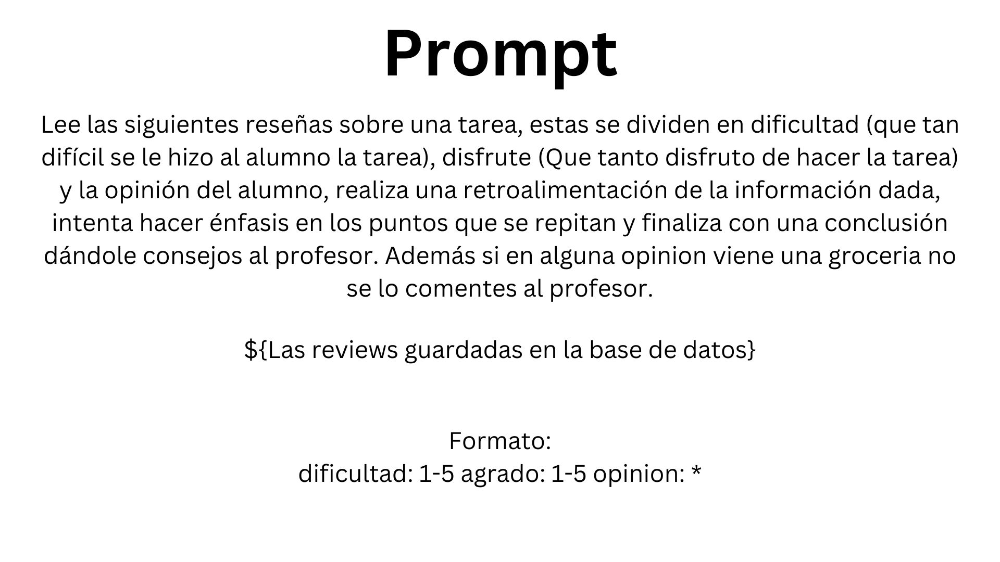
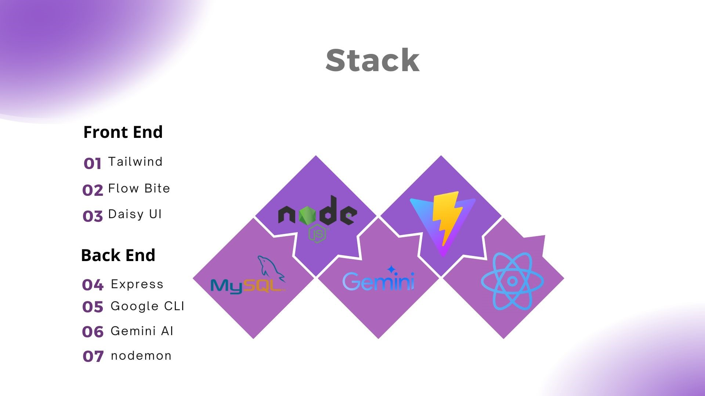

# OrgaNice

OrgaNice is a web application designed to maximize your **Organization** and **Communication with your teachers**. With Olga, our **AI Coach**, we create personalized tasks tailored to your specific goals and provide **personalized feedback** to your teachers about the tasks you are working on.



## Overview

OrgaNice is aimed at empowering both students and teachers by addressing the primary issues of inconsistency and the communication gap. Our practical solution involves personalized task creation and an efficient feedback system.


## Key Features

### Personalized Task Creation

Olga, our AI Coach, generates tasks centered around your individual goals, ensuring that your learning experience is tailored to your needs.


### Feedback System

Provides personalized feedback to your teachers about your progress and the tasks you are working on.


### Gemini 1.5 Pro Integration

Developed by Google, Gemini 1.5 Pro enhances the AI capabilities of Olga, ensuring high-quality task creation and feedback.


## Feedback Process

1. **Receive Feedback**: The system collects feedback with a 20% response rate.
2. **Create Feedback Text File**: Generates a text file with the feedback received.
3. **New Feedback File**: A new text file is created every time the teacher requests feedback.


## Prompts for Easy Understanding


(The provided information can be easily translated and organized for improved clarity and comprehension, tailored to the desired language of the generated report.)


## Our stack 


## Getting Started
**This project was moved to a new repository. For running the app follow ->** https://github.com/Goose03/OrgaNice2

To get started with OrgaNice, follow these steps:

1. **Clone the repository**:
   ```sh
   git clone https://github.com/yourusername/organice.git
   ```
2. **Navigate to the project directory**:
   ```sh
   cd organice
   ```
3. **Install the required dependencies**:
   ```sh
   npm install
   ```
4. **Start the application**:
   ```sh
   npm start
   ```


---

For any questions or further information, feel free to contact us at [support@organice.com](mailto:support@organice.com).

---
